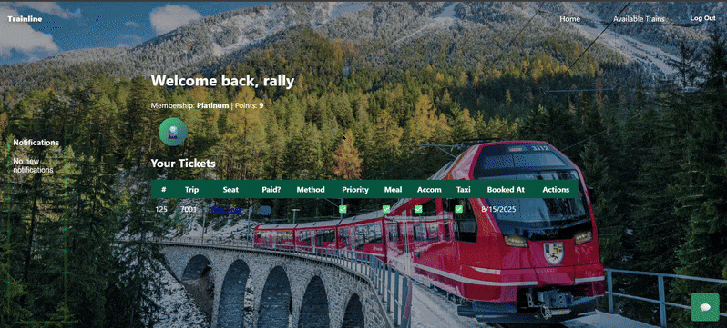
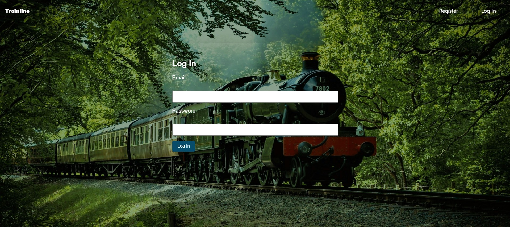
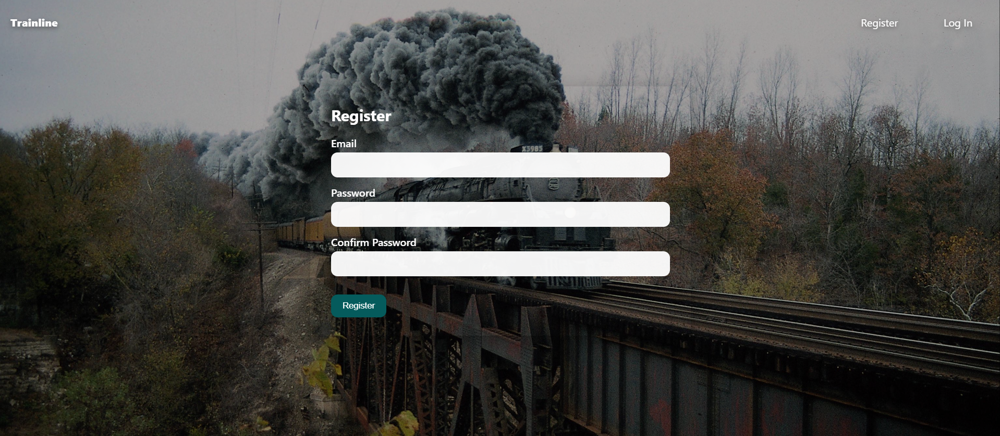
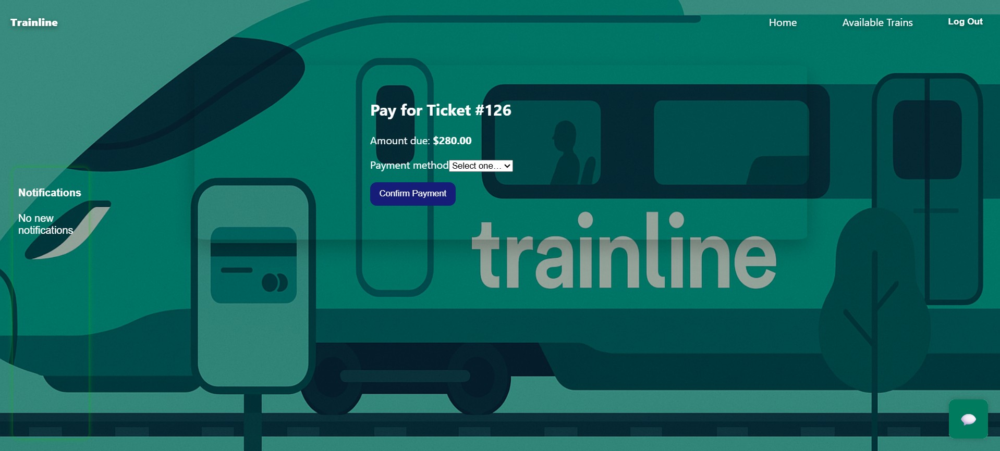

    # 🚆 Trainline 


## Demo



---


## Overview
Trainline is a full-stack project built with **Django (backend)**, **React (frontend)**, and **MySQL (database)**.  
It allows users to register, log in, browse train trips, book tickets, select seats, and make payments.  
This project was built independently for a **Database Systems class** to demonstrate DBMS concepts and relational design.

---

## Features
-  User Authentication (Register/Login)
-  Browse and book train trips
-  Ticket + Seat selection
-  Payment system
-  Notifications widget
-  Chat widget

---

## Screenshots






## Relational Schema
| Table             | Key Fields                        | Relationships                                |
|-------------------|-----------------------------------|----------------------------------------------|
| **User**          | user_id (PK), email, password     | One-to-many with Tickets                     |
| **Ticket**        | ticket_id (PK), user_id (FK)      | Many-to-many with Passenger (via bridge)     |
| **Passenger**     | passenger_id (PK), name           | Linked to Ticket via Ticket_Passenger        |
| **Flight/Train**  | flight_id (PK), route, time       | One-to-many with Tickets                     |
| **Payment**       | payment_id (PK), ticket_id (FK)   | One-to-one with Ticket                       |
| **Notifications** | notif_id (PK), user_id (FK)       | One-to-many with User                        |

---

##  Tech Stack
- **Frontend**: React (JSX, CSS)
- **Backend**: Django (REST Framework)
- **Database**: MySQL
- **Other**: JWT Authentication, Axios

---

## Local Setup & Installation [POWERSHELL]
Backend 
1) cd $HOME\Desktop\Trainline
   [ACTIVATE VIRTUAL ENVIRONMENT]
2) .\.venv\Scripts\Activate.ps1
   [IF YOU GET ERROR] 
3) Set-ExecutionPolicy -Scope Process -ExecutionPolicy Bypass
.\.venv\Scripts\Activate.ps1
4) python manage.py runserver


Frontend 
1) cd frontend
2) cp .env.example .env
3) npm install
4) npm start

---

## Docker Setup & Installation

### Prerequisites
- Docker and Docker Compose installed on your system

### Quick Start with Docker
1. **Clone the repository**
   ```bash
   git clone https://github.com/hs14235/Trainline.git
   cd Trainline
   ```

2. **Setup backend environment** (already created for Docker)
   ```bash
   # The backend/.env file is already configured for Docker
   # No changes needed unless you want to customize
   ```

3. **Build and start all services**
   ```bash
   docker compose up --build
   ```

4. **Access the application**
   - Frontend: http://localhost:3000
   - Backend API: http://localhost:8000/api
   - Admin Panel: http://localhost:8000/admin

### Docker Commands
```bash
# Start services in background
docker compose up -d

# Stop services
docker compose down

# View logs
docker compose logs -f

# Rebuild after code changes
docker compose up --build

# Reset database (removes all data)
docker compose down -v
docker compose up --build
```

### Notes
- The backend automatically runs migrations on startup
- Database data is persisted in a Docker volume
- Frontend is built with the correct API URL for Docker networking
- CORS is pre-configured for localhost access

---

## Credits
- Built for **CSCI 3321 - Database Systems & potential employers for insight on improvement**
- Thanks a lot to **Dr. Weitian Tong** for succint teaching with good sources of practice via website 

---

## License
This project is licensed under the [MIT License](LICENSE).


