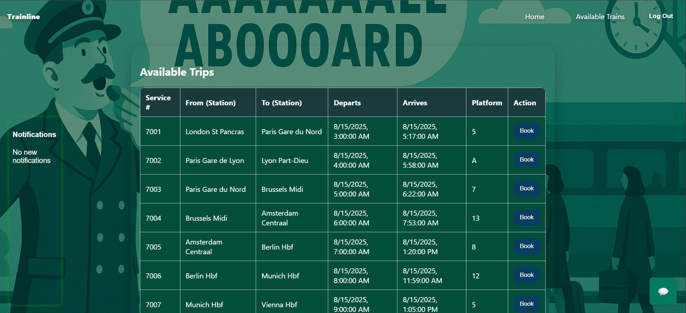

## Welcome to Trainline!


---


## Overview
Trainline is a full-stack project with MVC pattern for a complete SDLC built with **Django (backend)**, **React (frontend)**, and **PostgreSQL (database)**.  
It allows users to register, log in, browse train trips, book tickets, select seats, interact with chatbox and make payments with in-house UI implementations.  
This project was built independently for deployment onto the public domain for practical understanding of system design. 

---

## Features
-  User Authentication (Register/Login)
-  Browse and book train trips
-  Ticket + Seat selection
-  Payment system
-  Notifications widget
-  Chat widget

---

## Screenshots





## Relational Schema
| Table             | Key Fields                        | Relationships                                |
|-------------------|-----------------------------------|----------------------------------------------|
| **User**          | user_id (PK), email, password     | One-to-many with Tickets                     |
| **Ticket**        | ticket_id (PK), user_id (FK)      | Many-to-many with Passenger (via bridge)     |
| **Passenger**     | passenger_id (PK), name           | Linked to Ticket via Ticket_Passenger        |
| **Flight/Train**  | flight_id (PK), route, time       | One-to-many with Tickets                     |
| **Payment**       | payment_id (PK), ticket_id (FK)   | One-to-one with Ticket                       |
| **Notifications** | notif_id (PK), user_id (FK)       | One-to-many with User                        |

---

##  Tech Stack
- **Frontend**: React (JSX, CSS)
- **Backend**: Django (REST Framework)
- **Database**: MySQL
- **Other**: JWT Authentication, Axios

---

## Local Setup & Installation [POWERSHELL]
Backend 
1) cd $HOME\Desktop\Trainline
   [ACTIVATE VIRTUAL ENVIRONMENT]
2) .\.venv\Scripts\Activate.ps1
   [IF YOU GET ERROR] 
3) Set-ExecutionPolicy -Scope Process -ExecutionPolicy Bypass
.\.venv\Scripts\Activate.ps1
4) python manage.py runserver


Frontend 
1) cd frontend
2) cp .env.example .env
3) npm install
4) npm start

---

## Security & Production Deployment

This application has undergone a comprehensive security audit. For production deployment:

- **[SECURITY.md](SECURITY.md)** - Security audit report, vulnerabilities fixed, and best practices
- **[DEPLOYMENT.md](DEPLOYMENT.md)** - Step-by-step production deployment guide with Docker

### Quick Production Setup
```bash
# Generate secure secret key
python -c 'from django.core.management.utils import get_random_secret_key; print(get_random_secret_key())'

# Create .env file with production values
cp .env.production.example .env

# Deploy with Docker Compose
docker-compose -f docker-compose.yml -f docker-compose.prod.yml up -d
```

** Important:** Never use default credentials in production. See SECURITY.md for full checklist.

---


## License
This project is licensed under the [MIT License](LICENSE).
